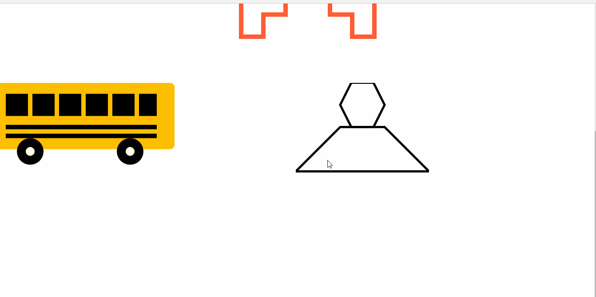

# Đề tài seminar - *HTML5 SVG*

**HTML5 SVG* là đề tài tìm hiểu của nhóm. Số thự tự nhóm: 12

Thành viên: 
	**Nguyễn Chí Tâm - 1312507
        Thông Thị Thanh Hằng - 1312178
	Phan Huỳnh Diệp Trúc - 1112508**

## Mô tả
* Nhóm tìm hiểu về HTML5 SVG là gì? Các thông tin, kiến thức liên quan và các ứng dụng của SVG cũng như các ứng dụng đã được thực hiện bằng SVG. Đồng thời, tạo 1 ứng dụng nho nhỏ demo cho đề tài tìm hiểu. 
* Trình bày trên slide.

## Nội dung:

Các nội dung đã tìm hiểu và *1 số* hình ảnh trong slide để minh họa:

- SVG là gì?
  !slide1.PNG
- Tìm hiểu thêm về XML.
- Thẻ <svg>
- Ưu điểm và nhược điểm.
- Cách sử dụng.
- So sánh với Canvas.
- Các ví dụ và ứng dụng liên quan.
- Ứng dụng demo của nhóm.

## Demo

Link ảnh GIF demo ứng dụng:

