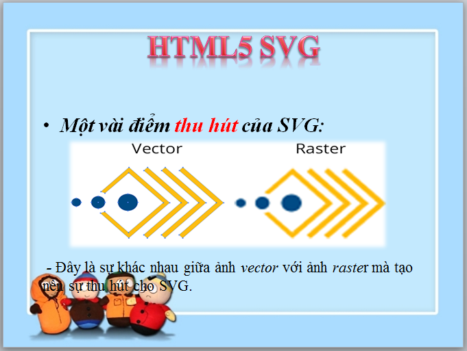

# Đề tài seminar - *HTML5 SVG*

**HTML5 SVG** là đề tài tìm hiểu của nhóm. Số thự tự nhóm: 12

Thành viên: 
	**Nguyễn Chí Tâm - 1312507
        Thông Thị Thanh Hằng - 1312178
	Phan Huỳnh Diệp Trúc - 1112508**

## Mô tả
```
* Nhóm tìm hiểu về HTML5 SVG là gì? 
* Các thông tin, kiến thức liên quan và các ứng dụng của SVG cũng như các ứng dụng đã được thực hiện bằng SVG. 
* Trình bày trên slide.
```

## Nội dung:

- Các nội dung đã tìm hiểu và ***1 số*** hình ảnh trong slide để minh họa:
  <ul>
  <li>SVG là gì?</li>
  
  <li>Tìm hiểu thêm về XML.</li>
  
  <li>Thẻ <svg></li>
  <li>Ưu điểm và nhược điểm.</li>
  
  <li>Cách sử dụng.</li>
  
  <li>So sánh với Canvas.</li>
  
  <li>Các ví dụ và ứng dụng liên quan.</li>
  </ul>

## Hình vẽ và hiệu ứng với SVG.

  Link ảnh GIF demo ứng dụng:


